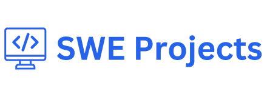

# SWE Projects

SWE Projects is an open source project that aims to help people build projects that go beyond working on localhost.
It aims to create high quality tutorials for high quality projects. 

[sweprojects.com](https://sweprojects.com)


## Why SWE Projects?
SWE Projects was created to be the go-to destination of high quality coding projects and tutorials on how to build them.

Most existing coding tutorials are random articles found on the internet or multiple hour long videos on Youtube that say a project is "complete" once it works on localhost.

We want to change that by creating high quality tutorials for technically impressive projects that you can actually deploy out onto the internet and share with friends, families, recruiters. 


## Get Started
To run SWE Projects locally, just run the following commands install the dependencies and run the app locally.

```
npm install

npm run dev
```

We currently do not provide access to the database with the coding instructions. You will need to create your own database and update the connection string in a .env file.

We are working on writing up some instructions on how to create your own database instance to develop locally. 

## Is SWE Projects Free?

We plan to include the source code for every project that we write a tutorial for. However, we do plan to charge for the step-by-step written tutorials at [sweprojects.com](https://sweprojects.com).

## Community & Support


* [Discord](https://discord.gg/2p2e5tTmzw) — chat with the SWE Projects team and other developers
* [Canny](https://sweprojects.canny.io/feature-requests) - Request/upvote feature requests and project requests
* [GitHub issues](https://github.com/YourAverageTechBro/SWEProjects/issues/new) - to report bugs

## How You Can Contribute
### Submit a project + Write a Tutorial

Have a project that you built that you want to write a tutorial for? Join our [Discord](https://discord.gg/2p2e5tTmzw) and
post a message in the `#project-proposal` channel. If you create a project tutorial, we will split all sales of the
project tutorial with you — a great way to make some extra income. 

### Translate an existing project to another language
We want to make sure that every project in SWE Projects is offered in a variety of languages and tech stacks.
If you see a project that you want to translate into a different project, join our [Discord](https://discord.gg/2p2e5tTmzw)
and post a message in the `#project-translation` channel.

